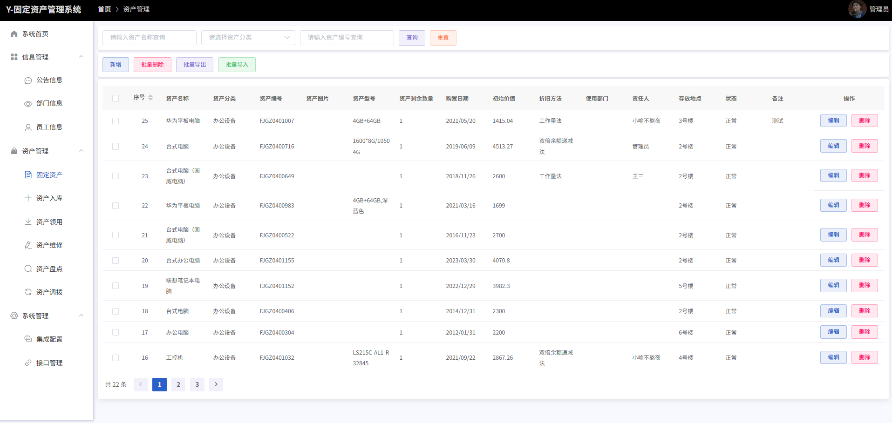

# 固定资产管理系统

  

## 系统介绍

固定资产管理系统是一个基于Vue和SpringBoot开发的现代化资产管理平台，旨在帮助企业高效管理固定资产的全生命周期。系统提供了资产入库、领用、维修、盘点、调拨等核心功能，同时集成了企业微信和钉钉等第三方平台，实现了资产管理的数字化和智能化。

---

## 主要功能

- **资产管理**：资产信息录入、查询、修改和删除
- **资产入库**：新购资产的入库登记和管理
- **资产领用**：员工资产领用申请和审批流程
- **资产维修**：资产维修记录和跟踪
- **资产盘点**：定期资产盘点和差异分析
- **资产调拨**：部门间资产调拨管理
- **用户管理**：管理员和员工账户管理
- **部门管理**：企业部门结构管理
- **集成管理**：第三方平台（企业微信、钉钉）集成配置
- **接口管理**：系统API接口配置和管理

---

## 软件架构

### 前端架构
- **框架**：Vue 2.x
- **UI组件库**：Element UI
- **路由**：Vue Router
- **HTTP客户端**：Axios
- **图表库**：ECharts

### 后端架构
- **框架**：SpringBoot
- **数据库**：MySQL（推测）
- **API风格**：RESTful

---

## 项目结构

```plaintext
├── springboot/# 后端项目
│├── src/# 源代码
│├── pom.xml# Maven配置
│└── files/# 上传文件存储
└── vue/# 前端项目
├── public/# 静态资源
├── src/# 源代码
│├── assets/# 静态资源
│├── components/# 组件
│├── router/# 路由配置
│├── utils/# 工具类
│├── views/# 页面
│├── App.vue# 根组件
│└── main.js# 入口文件
├── package.json# NPM配置
└── vue.config.js# Vue配置
```

---

## 安装教程

### 环境要求
- Node.js 12.x+
- JDK 1.8+
- Maven 3.6+
- MySQL 8.0.19

### 前端部署
1. 进入前端项目目录：
```bash
cd vue
```
2. 安装依赖：
```bash
npm install
```
3. 开发环境运行：
```bash
npm run serve
```
4. 生产环境构建：
```bash
npm run build
```

### 后端部署
1. 进入后端项目目录：
```bash
cd springboot
```
2. 使用Maven构建项目：
```bash
mvn clean package
```
3. 运行项目：
```bash
java -jar target/xm-assets.jar
```

---

## 使用说明

### 登录系统
1. 访问系统登录页面
2. 输入用户名、密码和验证码
3. 点击登录按钮或使用企业微信/钉钉第三方登录


### 资产管理
1. 登录后进入管理界面
2. 在左侧菜单选择「资产管理」→「固定资产」
3. 进行资产的查询、新增、修改和删除操作


### 资产入库
1. 在左侧菜单选择「资产管理」→「资产入库」
2. 填写资产入库信息并提交


### 资产领用
1. 在左侧菜单选择「资产管理」→「资产领用」
2. 选择需要领用的资产并提交申请


3. 审批通过后，员工可以领用资产

### 资产维修
1. 在左侧菜单选择「资产管理」→「资产维修」
2. 登记资产维修信息


### 资产盘点
1. 在左侧菜单选择「资产管理」→「资产盘点」
2. 进行资产盘点操作并记录结果

3. 盘点结果可用于资产管理、资产调拨等


### 资产调拨
1. 在左侧菜单选择「资产管理」→「资产调拨」
2. 进行资产调拨操作并记录结果


### 第三方系统集成配置
1. 在左侧菜单选择「集成管理」→「集成配置」
2. 配置企业微信或钉钉的集成参数


---

## 项目来源

本项目基于[xm-webapp](https://gitee.com/xm-online/xm-webapp)的前端框架进行开发的，后端·数据库底层进行重构和优化，并集成了企业微信集成配置功能（基于钉钉的集成配置功能还在完善中）。
功能模块全部进行了重构，并新增了资产管理、资产入库、资产领用、资产维修、资产盘点、集成管理等模块。


---

## 注意事项
1. 首次使用请修改数据库连接配置
2. 第三方登录功能需要先在「集成管理」中配置相关参数
3. 路由配置位于 `vue/src/router/index.js`，如需修改请同步更新相关组件中的路径引用

---

**提示**：如有任何疑问或建议，请联系作者邮箱：495944966@qq.com
